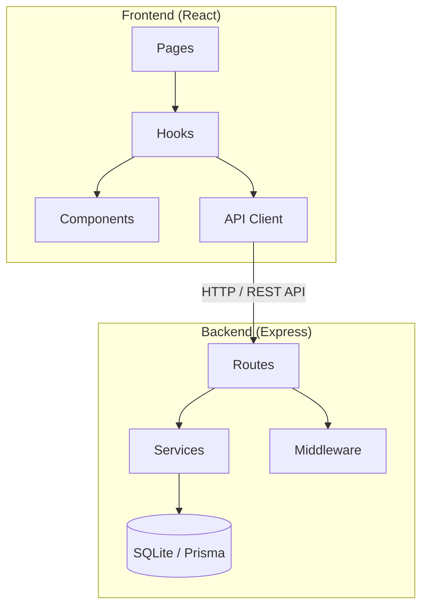
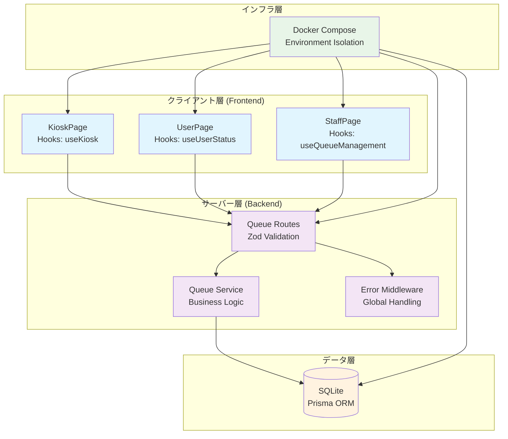
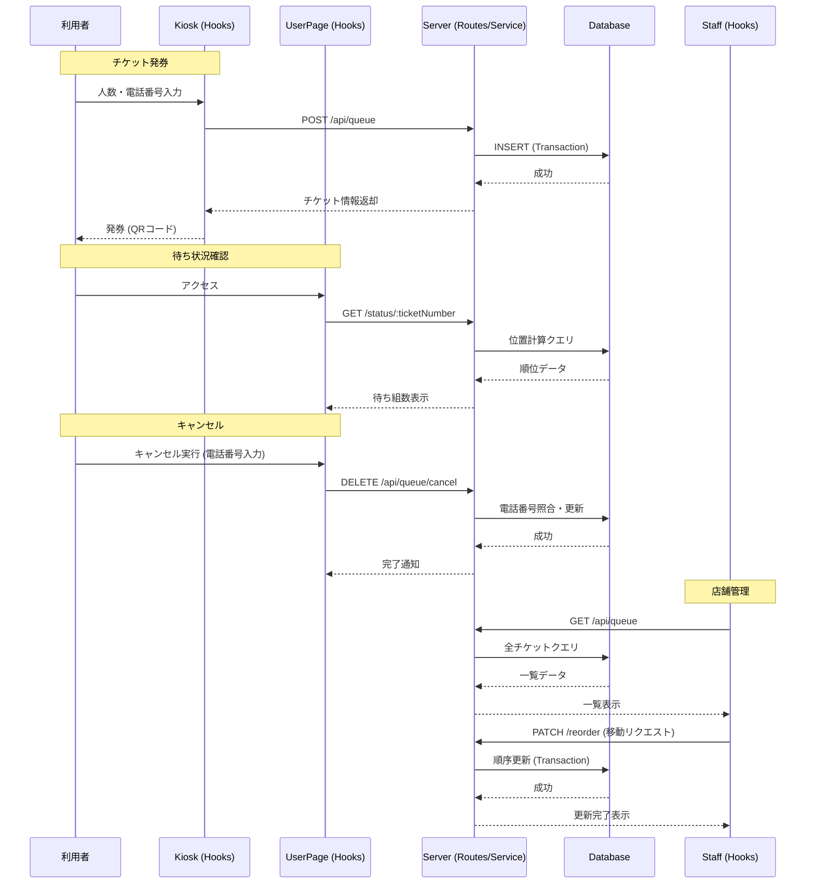
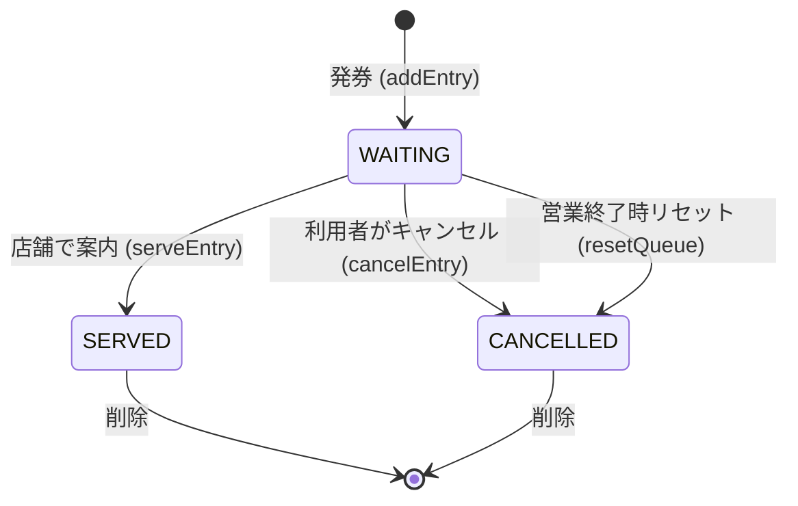

# 待ち列管理システム - システム概要

## 概要

このシステムは飲食店などの店舗で利用者の待ち列を管理するためのWebアプリケーションです。利用者がチケットを発券して待ち列に加わり、店舗スタッフが待ち列を操作・管理することが主な目的です。

**技術スタック:**
- **サーバー側**: Node.js + Express + TypeScript
- **クライアント側**: React (Vite) + TypeScript + Tailwind CSS
- **データベース**: SQLite (Prisma ORM)
- **バリデーション**: Zod
- **テスト**: Vitest (Frontend), Jest (Backend)
- **インフラ**: Docker Compose

---

## システム構成 (Architecture)

リファクタリングにより、関心の分離（Separation of Concerns）を徹底したレイヤー構造を採用しています。

### 1. フロントエンド (Frontend)
- **Pages**: 画面単位のコンポーネント。
- **Hooks**: ロジック、API呼び出し、状態管理のカプセル化。
- **Components**: 機能部品 (`features/`) と 共通部品 (`ui/`)。
- **API**: バックエンドとの通信 (Axios)。

### 2. バックエンド (Backend)
- **Routes**: エンドポイント定義とバリデーション。
- **Services**: ビジネスロジックとDB操作。
- **Middleware**: 共通処理（エラーハンドリング等）。

---

## システムの主要コンポーネントと役割

### 1. 待ち列作成機 (Kiosk / Queue Creator)
**役割**
- 店舗入口に置かれるインターフェース。利用者が人数と電話番号を入力してチケットを発券。
- 発券されたチケットにはQRコード（URL）が含まれる。
- チケット番号と電話番号によるキャンセル機能を提供。現在の総待ち組数を表示。
**技術的実装**
- クライアント側: `KioskPage.tsx`, `useKiosk.ts`
- サーバー側: `queue.routes.ts` (`POST /api/queue`), `queue.service.ts` (`addEntry`)

### 2. 利用ユーザー画面 (User Dashboard)
**役割**
- チケットのQRコードをスキャンしてアクセス。
- 自分の待ち列の位置（自分を含めた前方の組数）を表示。
- 自分のチケットのみキャンセル可能（電話番号認証）。
**技術的実装**
- クライアント側: `UserPage.tsx`, `useUserStatus.ts`
- サーバー側: `queue.routes.ts` (`GET /status/:ticketNumber`)

### 3. 店舗オペレーション画面 (Staff Dashboard)
**役割**
- 店舗スタッフが待ち列の一覧を表示・管理。案内済みの組を削除。
- オペレーションミス対策で以下の操作が可能：
  - 順位の上げ下げ (UP/DOWN)、最上部/最下部移動 (TOP/BOTTOM)、任意の待ちを削除。
  - 営業終了時の全データリセット。
**技術的実装**
- クライアント側: `StaffPage.tsx`, `useQueueManagement.ts`
- サーバー側: `queue.routes.ts` (`PATCH /reorder`, `POST /reset`)

### 4. サーバー (Backend / API Server)
**役割**
- クライアントからのリクエストを処理。データベースとのやり取りを担当。
- RESTful APIを提供し、ビジネスロジックを `queue.service.ts` に集約。
**主要なAPI エンドポイント:**
- `GET /api/queue/stats` - 総待ち組数取得
- `POST /api/queue` - チケット作成
- `GET /api/queue` - 待ち列一覧取得
- `GET /api/queue/status/:ticketNumber` - チケット情報取得
- `DELETE /api/queue/cancel` - チケットキャンセル
- `DELETE /api/queue/:id` - 案内完了（削除）
- `PATCH /api/queue/reorder` - 順位変更
- `POST /api/queue/reset` - 全データクリア

### 5. データベース (DB)
**役割**
- 待ち列データの永続化。`QueueEntry` テーブルに以下の情報を保存：
  - `ticketNumber`, `peopleCount`, `phoneNumber`, `position`, `status` (WAITING, SERVED, CANCELLED), `createdAt`
**技術的役割**
- SQLiteを使用。Prisma ORMで抽象化され、マイグレーション機能あり。

### 6. Docker (インフラ)
**役割**
- サーバー、DB、クライアントを統合。開発/本番環境を統一。
- ポート: バックエンド(3001), フロントエンド(8080)。ボリュームマウントによりDBを永続化。

---

## 依存関係の概要

**詳細な依存関係:**
- **クライアント**: サーバーAPIに依存。HooksがAPIレスポンスを受け取り、ステートを更新してUIを再レンダリングします。
- **サーバー**: DBに依存。ServicesがDBからデータを取得/保存し、トランザクションで整合性を保証します。
- **DB**: サーバーからのクエリに依存。独立したデータストア。
- **全体**: Dockerが各コンポーネントのネットワーク接続とボリュームマウントを解決します。

---

## データフロー

### 1. チケット発券フロー
1. 客が人数・電話番号を入力。
2. `useKiosk` -> `POST /api/queue` へリクエスト送信。
3. サーバーがトランザクション内で位置計算とインサートを実行。
4. 生成されたチケット情報（QR URL含む）を返却し、画面に表示。

### 2. 待ち状況確認フロー
1. 客がQRコードをスキャンしてアクセス。
2. `useUserStatus` -> `GET /status/:ticketNumber` へ自動取得。
3. サーバーが自分を含めた前方の `WAITING` 数を計算。
4. 待ち組数を画面に表示。

### 3. キャンセルフロー
1. 客がキャンセルを選択し、電話番号を入力。
2. `useUserStatus` -> `DELETE /api/queue/cancel` へ認証情報と共に送信。
3. サーバーが電話番号を照合し、一致すれば `status` を `CANCELLED` に更新。
4. キャンセル完了メッセージを表示。

### 4. 店舗オペレーションフロー
1. スタッフが `StaffPage` にアクセス。
2. `useQueueManagement` -> `GET /api/queue` から一覧を取得。
3. 操作（削除/移動等）に応じて `PATCH /reorder` 等を呼び出し。
4. DB更新後、最新の待ち列を再取得して表示を更新。

---

## システム構成図 (詳細)

---

## データシーケンス図 (全体)

---

## チケットのライフサイクル

---

## テスト戦略 (Testing Strategy)

テストコードはプロダクションコードと分離されつつ、構造を模倣したミラーリング構成を採用しています。

**ディレクトリ構成:**
- `frontend/src/__tests__/`: Hooks, UIコンポーネントのテスト。
- `backend/src/__tests__/`: Services, APIエンドポイントのテスト。

**検証範囲:**
- **Hooks**: APIレスポンスに基づいた状態遷移、ローディング、エラーハンドリング。
- **UI**: ユーザーイベント（クリック、入力）の正確な発火とレンダリング。
- **Service**: DBトランザクション整合性、順序変更ロジック。
- **Integration**: ルーティング、Zodバリデーション、エラーミドルウェアの連動。

---

## セキュリティと認証

### チケット認証
- **方式**: チケット番号 + 電話番号マッチング。利用者のキャンセル機能のみに適用。
- **実装**: `queueService` 内で電話番号の完全一致を検証。

### スタッフ画面
- **認証**: なし（オープンアクセス）。信頼できるローカルネットワーク内での使用を想定。

---

## リアルタイム性とスケーラビリティ

- **リアルタイム性**: 現在は手動リロードまたは Hooks 内のインターバル（10秒/5秒）によるポーリングで更新。
- **DB拡張性**: Prisma を通じて PostgreSQL 等への移行が可能。
- **店舗拡張**: データベースに `storeId` を導入することで多店舗展開に対応可能。

---

## 営業終了時の処理

- **リセット処理**: スタッフ画面の「Reset Day」ボタンにより、全待機データを `CANCELLED` に更新。
- **将来像**: バッチ処理（Cronジョブ）による深夜の自動クリアを想定。

---

## 次のステップ

1. ユニットテスト・統合テストの拡充 (継続中)
2. UI/UXの洗練とモバイル最適化
3. WebSocket 導入による完全リアルタイム更新の検討
4. スタッフ画面への認証 (JWT/Session) 追加
