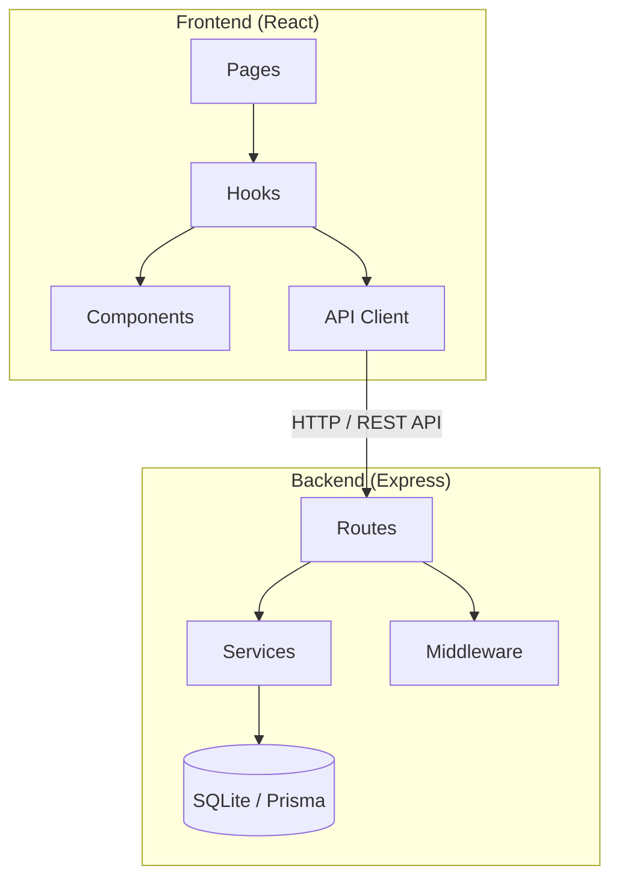

# 待ち列管理システム - システム概要

## 概要

このシステムは飲食店などの店舗で利用者の待ち列を管理するためのWebアプリケーションです。利用者がチケットを発券して待ち列に加わり、店舗スタッフが待ち列を操作・管理することが主な目的です。

**技術スタック:**
- **サーバー側**: Node.js + Express + TypeScript
- **クライアント側**: React (Vite) + TypeScript + Tailwind CSS
- **データベース**: SQLite (Prisma ORM)
- **バリデーション**: Zod
- **テスト**: Vitest (Frontend), Jest (Backend)
- **インフラ**: Docker Compose

---

## システム構成 (Architecture)

リファクタリングにより、関心の分離（Separation of Concerns）を徹底したアーキテクチャを採用しています。

### 1. フロントエンド (Frontend)

**ディレクトリ構成:** `frontend/src/`
- **Pages**: ルーティングに対応する各画面の宣言的な定義。
- **Hooks**: ビジネスロジック、API呼び出し、状態管理をカプセル化。
- **Components**:
    - **features**: 各機能に特化したUIコンポーネント。
    - **ui**: ボタンやインプットなど、再利用可能な基本部品。
- **API**: バックエンドAPIとの通信を担当。

**技術的特徴:**
- カスタムフック (`useKiosk`, `useUserStatus`, `useQueueManagement`) によるロジックの共通化。
- React Testing Library + Vitest による包括的なテスト（20個以上のテストケース）。

### 2. バックエンド (Backend)

**ディレクトリ構成:** `backend/src/`
- **Routes**: エンドポイントの定義とZodによる入力バリデーション。
- **Services**: ビジネスロジックの実装（DB操作を含む）。
- **Middleware**: 共通処理（エラーハンドリングなど）。
- **Lib**: 共通ライブラリ（Prisma Clientなど）。

**技術的特徴:**
- レイヤー分離により、APIの仕様変更とビジネスロジックの変更を独立して実施可能。
- 共通エラーミドルウェア (`error.middleware.ts`) による一貫したエラーレスポンス。
- Jest によるユニット/インテグレーションテスト（14個のテストケース）。

---

## 主要なコンポーネントと役割

### 1. 待ち列作成機 (Kiosk / Queue Creator)
- **Pages**: `KioskPage.tsx`
- **Hooks**: `useKiosk.ts`
- **役割**: 利用者の人数・電話番号の入力、チケット発券、現在の統計情報の表示。

### 2. 利用ユーザー画面 (User Dashboard)
- **Pages**: `UserPage.tsx`
- **Hooks**: `useUserStatus.ts`
- **役割**: 自身の待ち順位（groupsAhead）のリアルタイム確認、自身のチケットのキャンセル。

### 3. 店舗オペレーション画面 (Staff Dashboard)
- **Pages**: `StaffPage.tsx`
- **Hooks**: `useQueueManagement.ts`
- **役割**: 全待ち列の管理。案内の完了、任意のエントリの削除、割り込み対応のための順序変更（UP/DOWN/TOP/BOTTOM）、営業終了時のリセット。

---

## 依存関係の概要

---

## テスト戦略 (Testing Strategy)

テストコードはプロダクションコードと分離されつつ、構造を模倣したミラーリング構成を採用しています。

**ディレクトリ構成:**
- `frontend/src/__tests__/`
- `backend/src/__tests__/`

**検証範囲:**
- **Hooks**: APIレスポンスに基づいた状態遷移、ローディング管理、エラー通知。
- **Components**: ユーザーイベント（クリック、入力）の正常な発火、レンダリング。
- **Services**: DBトランザクション、順序変更ロジック、認証（電話番号照合）。
- **API**: エンドポイントの正常系・異常系、ステータスコードの整合性。

---

## データフロー (Data Flow)

### 1. チケット発券
1. `KioskPage` (UI) -> `useKiosk` (Hook) -> `queueApi.issueTicket` (API)
2. `queueRouter` (Backend Route) -> Zod Validation -> `queueService.addEntry` (Service)
3. `Prisma` -> SQLite Transaction (位置計算 + チケット番号生成)

### 2. 順序変更 (Staff)
1. `StaffPage` -> `useQueueManagement` -> `queueApi.reorder`
2. `queueRouter` -> Zod Validation -> `queueService.reorder`
3. `Prisma` -> SQLite Transaction (複数エントリの一括位置更新)

---

## 運用とスケーラビリティ

- **Docker Compose**: 開発環境の統一と、単一コマンドでの環境構築を実現。
- **Prisma ORM**: SQLiteからPostgreSQL等の他のRDBへの移行が、スキーマ設定の変更のみで可能。
- **レイヤー化**: 将来的には `queueService` をマイクロサービス化したり、`Hooks` を複数のクライアントで共有したりすることが容易な設計。

---

## 今後の拡張性

1. **リアルタイム通知**: WebSocket (Socket.io) 導入によるステータスの自動更新。
2. **多店舗対応**: データベースに `storeId` を導入し、テナント分離を実現。
3. **認証システム**: 店舗スタッフ向けのログイン認証 (OAuth/JWT) の追加。
