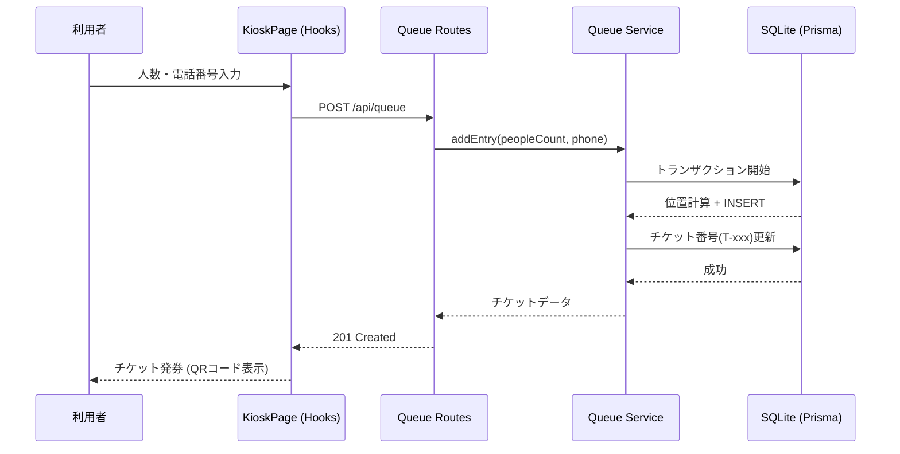
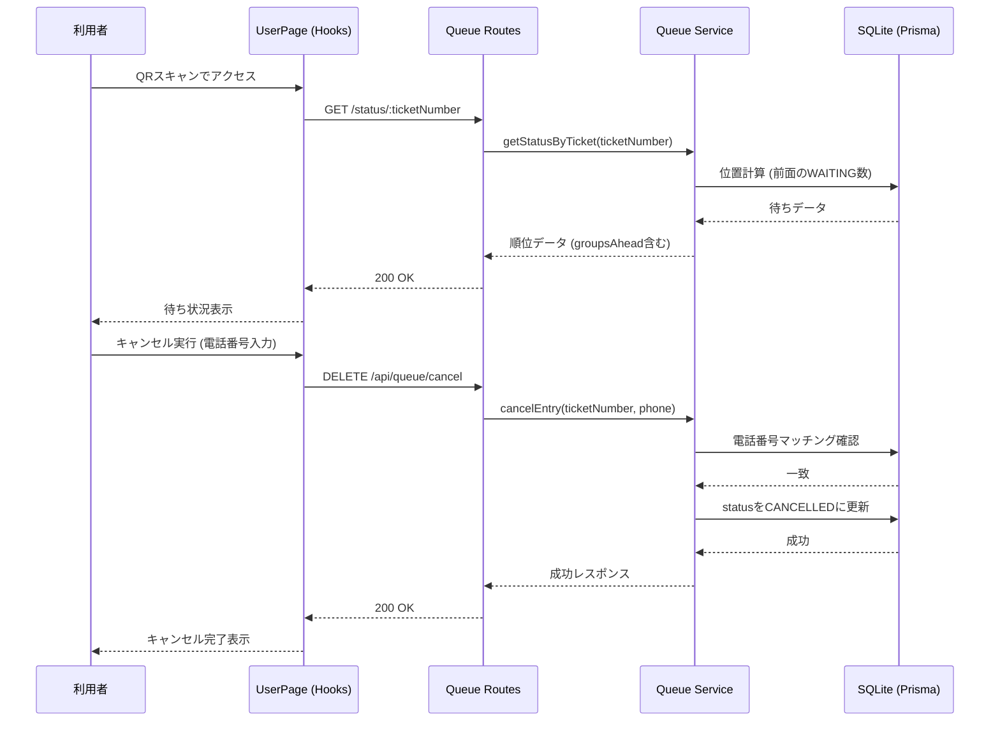
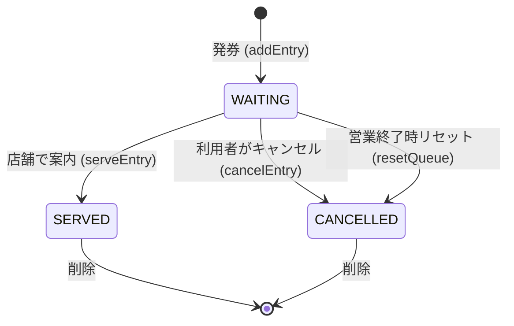

# 待ち列管理システム - システム概要

## 概要

このシステムは飲食店などの店舗で利用者の待ち列を管理するためのWebアプリケーションです。利用者がチケットを発券して待ち列に加わり、店舗スタッフが待ち列を操作・管理することが主な目的です。

**技術スタック:**
- **サーバー側**: Node.js + Express + TypeScript
- **クライアント側**: React (Vite) + TypeScript + Tailwind CSS
- **データベース**: SQLite (Prisma ORM)
- **バリデーション**: Zod
- **テスト**: Vitest (Frontend), Jest (Backend)
- **インフラ**: Docker Compose

---

## システム構成 (Architecture)

リファクタリングにより、関心の分離（Separation of Concerns）を徹底したレイヤー構造を採用しています。

### 1. フロントエンド (Frontend)

**ディレクトリ構成:** `frontend/src/`
- **Pages**: ルーティングに対応する各画面の宣言的な定義。
- **Hooks**: ビジネスロジック、API呼び出し、状態管理をカプセル化。
- **Components**:
    - **features**: 各機能に特化したUIコンポーネント。
    - **ui**: ボタンやインプットなど、再利用可能な基本部品。
- **API Client**: バックエンドAPIとの通信（Axiosベース）を担当。

**技術的特徴:**
- カスタムフック (`useKiosk`, `useUserStatus`, `useQueueManagement`) によるロジックの共通化とテスト性の向上。
- React Testing Library + Vitest による包括的なテスト（20個以上のテストケース）。

### 2. バックエンド (Backend)

**ディレクトリ構成:** `backend/src/`
- **Routes**: エンドポイントの定義とZodによる入力バリデーション、エラーミドルウェアへの橋渡し。
- **Services**: ビジネスロジックの実装（DBトランザクション、順序計算など）。
- **Middleware**: 共通処理（一貫したエラーハンドリングミドルウェアなど）。
- **Lib**: 共通ライブラリ（Prisma Clientのシングルトンインスタンスなど）。

**技術的特徴:**
- レイヤー分離により、APIのインターフェース変更とビジネスロジックの変更を独立して実施可能。
- Jest によるユニット/インテグレーションテスト（14個のテストケース）。

---

## システムの主要コンポーネントと役割

### 1. 待ち列作成機 (Kiosk / Queue Creator)

**役割**
- 店舗入口に置かれるインターフェース。
- 利用者が人数と電話番号を入力してチケットを発券。
- 発券されたチケットにはQRコード（URL）が含まれる。
- チケット番号と電話番号によるキャンセル機能を提供。
- 現在の総待ち組数を表示。

**技術的実装**
- クライアント側: `KioskPage.tsx`, `useKiosk.ts`
- サーバー側: `queue.routes.ts` (`POST /api/queue`), `queue.service.ts` (`addEntry`)

### 2. 利用ユーザー画面 (User Dashboard)

**役割**
- チケットのQRコードをスキャンしてアクセスするページ。
- 自分の待ち列の位置（自分を含めた前方の組数）を表示。
- 自分のチケットのみキャンセル可能（チケット番号 + 電話番号認証）。
- 他の利用者の待ち列は操作不可。

**技術的実装**
- クライアント側: `UserPage.tsx`, `useUserStatus.ts`
- サーバー側: `queue.routes.ts` (`GET /status/:ticketNumber`), `queue.service.ts` (`getStatusByTicket`)

### 3. 店舗オペレーション画面 (Staff Dashboard)

**役割**
- 店舗スタッフが待ち列の一覧を表示・管理。
- 案内済みの組を削除（Serve処理）。
- オペレーションミス対策で以下の操作が可能：
  - 待ちを順位の上げ下げで移動 (UP/DOWN)。
  - 待ちを最上部に移動 (TOP / 割り込み対応用)。
  - 待ちを最下部に移動 (BOTTOM)。
  - 任意の待ちを削除。
- 営業終了時の全データリセット（Reset Day）。

**技術的実装**
- クライアント側: `StaffPage.tsx`, `useQueueManagement.ts`
- サーバー側: `queue.routes.ts` (`PATCH /reorder`, `POST /reset`), `queue.service.ts` (`reorder`, `resetQueue`)

---

## データベース (Database)

**役割**: 待ち列のデータを永続化し、チケット情報を保存。

**主なフィールド (QueueEntryテーブル):**
- `id`: 内部管理用自動増分ID。
- `ticketNumber`: 利用者向けチケット番号 (例: T-001)。
- `peopleCount`: 利用人数。
- `phoneNumber`: キャンセル認証用の電話番号（完全一致で検証）。
- `position`: 待ち列内の順序（1から始まる整数）。
- `status`: 状態 (`WAITING`, `SERVED`, `CANCELLED`)。
- `createdAt`: 発券日時。

---

## データフローとシーケンス

### 1. チケット発券フロー

### 2. 待ち状況確認・キャンセルフロー

---

## チケットのライフサイクル

---

## テスト戦略 (Testing Strategy)

テストコードはプロダクションコードと分離されつつ、構造を模倣したミラーリング構成を採用しています。

**ディレクトリ構成:**
- `frontend/src/__tests__/`: Hooks, UIコンポーネントのテスト。
- `backend/src/__tests__/`: Services, APIエンドポイントのテスト。

**主なテストカテゴリ:**
- **Hooks テスト (Vitest)**: API通信、状態遷移、エラーハンドリングの検証。
- **UI テスト (React Testing Library)**: ボタン、入力フォームの挙動、アクセシビリティ。
- **Service テスト (Jest)**: DBトランザクションの整合性、ビジネスロジック（順序変更、認証）の正確性。
- **Integration テスト (Supertest)**: ルーティング、バリデーション、エラーミドルウェアの連動確認。

---

## セキュリティと認証

### チケット認証
- **方式**: チケット番号 + 電話番号マッチングによる軽量認証。
- **対象**: 利用ユーザーのキャンセル機能のみ。
- **実装**: `queueService` 内で `phoneNumber` の完全一致を検証。

### スタッフ画面
- **認証**: 現状なし（オープンアクセス、信頼できるローカルネットワーク内での使用を想定）。

---

## デプロイと運用

- **Docker Compose**: `docker-compose.yml` により、バックエンド、フロントエンド、DBを一括で起動。
- **Prisma Migration**: `npx prisma db push` により、スキーマ変更を自動的にSQLite DBに適用。
- **ボリュームマウント**: `dev.db` をホストマシンにマウントし、コンテナ再起動時もデータを永続化。
