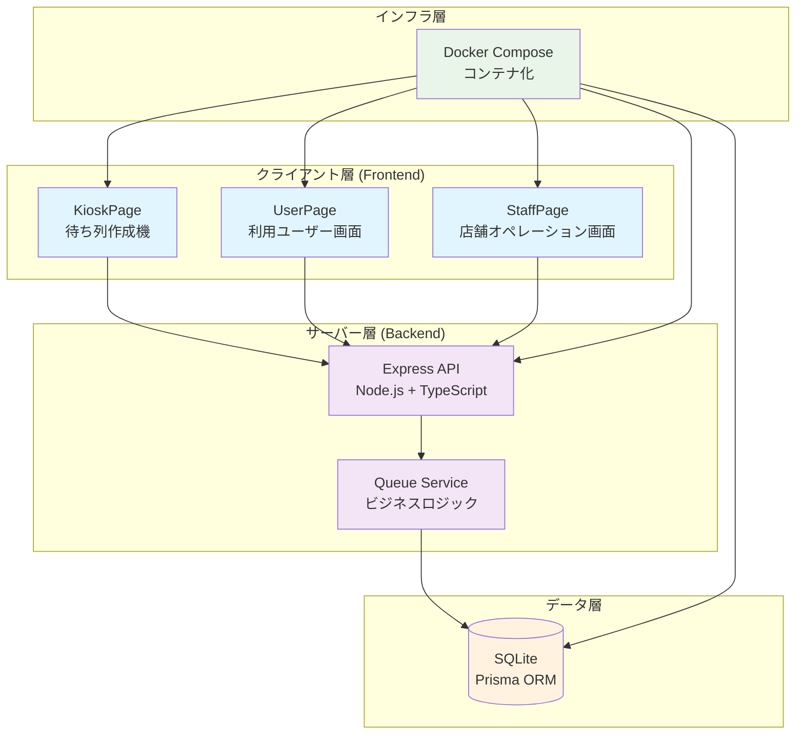
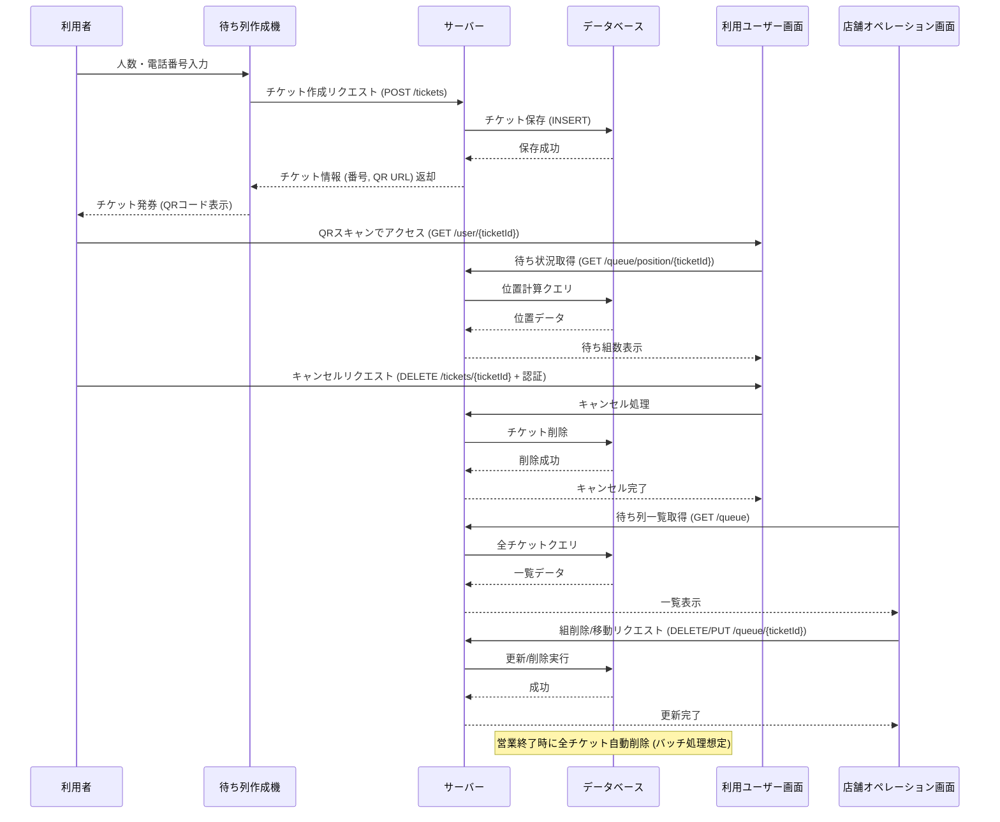

# 待ち列管理システム - システム概要

## 概要

このシステムは飲食店などの店舗で利用者の待ち列を管理するためのWebアプリケーションです。利用者がチケットを発券して待ち列に加わり、店舗スタッフが待ち列を操作・管理することが主な目的です。

**技術スタック:**
- **サーバー側**: Node.js + TypeScript
- **クライアント側**: React + TypeScript + Tailwind CSS
- **データベース**: SQLite (Prisma ORM)
- **インフラ**: Docker Compose

---

## システムの主要コンポーネントと役割

### 1. 待ち列作成機 (Kiosk / Queue Creator)

**役割**
- 店舗入口に置かれるインターフェース
- 利用者が人数と電話番号を入力してチケットを発券
- 発券されたチケットにはQRコード（URL）が含まれる
- チケット番号と電話番号でキャンセル機能を提供
- 現在の総待ち組数を表示

**利用者**
- 店舗スタッフまたは利用者（セルフサービス）

**技術的役割**
- クライアント側のReactコンポーネント（KioskPage.tsx）
- サーバーAPIを呼び出してチケット作成/キャンセル処理を実行

### 2. 利用ユーザー画面 (User Dashboard / UserPage)

**役割**
- チケットのQRコードをスキャンしてアクセスするページ
- 自分の待ち列の位置を表示（自分を含めた前方の組数）
- 自分のチケットのみキャンセル可能（チケット番号 + 電話番号認証）
- 他の利用者の待ち列は操作不可
- チケットは営業終了時に自動失効

**利用者**
- 待ち列に加わった利用者

**技術的役割**
- クライアント側のReactコンポーネント（UserPage.tsx）
- サーバーAPIから待ち状況を取得し、キャンセルリクエストを送信

### 3. 店舗オペレーション画面 (Store Operations Dashboard / StaffPage)

**役割**
- 店舗スタッフが待ち列の一覧を表示・管理
- 案内済みの組を削除
- オペレーションミス対策で以下の操作が可能：
  - 待ちを順位の上げ下げで移動
  - 待ちを最上部に移動（割り込み対応用）
  - 待ちを最下部に移動
  - 任意の待ちを削除
- 認証不要でオープンアクセス

**利用者**
- 店舗スタッフ

**技術的役割**
- クライアント側のReactコンポーネント（StaffPage.tsx）
- サーバーAPIを介して待ち列のCRUD操作を実行

### 4. サーバー (Backend / API Server)

**役割**
- クライアントからのリクエストを処理
- データベースとのやり取りを担当
- 待ち列の作成、更新、削除、取得などのビジネスロジックを実装
- DB操作は抽象化され、SQLiteから他のRDB（例: PostgreSQL）への移行が可能

**技術的役割**
- Node.js + TypeScriptで構築（Express.js フレームワーク）
- RESTful APIを提供
- Queue Service（queue.service.ts）でビジネスロジックを実装
- クライアントとDBの仲介役

**主要なAPI エンドポイント:**
- `GET /api/queue/stats` - 総待ち組数取得
- `POST /api/queue` - チケット作成
- `GET /api/queue` - 待ち列一覧取得
- `GET /api/queue/:ticketNumber` - チケット情報取得
- `DELETE /api/queue/:ticketNumber` - チケットキャンセル
- `PUT /api/queue/:id/reorder` - 待ち列の順位変更

### 5. データベース (DB)

**役割**
- 待ち列のデータを永続化
- チケット情報を保存
  - チケット番号
  - 人数
  - 認証用電話番号
  - 待ち列の位置
  - ステータス（WAITING, SERVED, CANCELLED）
  - 作成日時
- 営業終了時にチケットをクリア

**技術的役割**
- SQLiteを使用
- Prisma ORM で抽象化
- マイグレーション機能あり

### 6. Docker (インフラ)

**役割**
- システム全体を1つのコマンドで起動
- サーバー、DB、クライアントを統合
- 開発/本番環境を統一

**技術的役割**
- docker-compose.yml で定義
- ポートマッピング:
  - バックエンド: 3001
  - フロントエンド: 8080

---

## 依存関係の概要

```
┌─────────────────────────────────────┐
│       クライアント (React)           │
│  KioskPage / UserPage / StaffPage  │
└──────────────────┬──────────────────┘
                   │ HTTP/REST API
                   ▼
        ┌──────────────────────┐
        │  サーバー (Node.js)   │
        │  Express + TypeScript │
        └──────────────┬───────┘
                       │ SQL Query
                       ▼
              ┌────────────────┐
              │ データベース     │
              │ (SQLite + ORM) │
              └────────────────┘
```

**詳細な依存関係:**
- **クライアント**: サーバーAPIに依存
  - APIレスポンスに基づいてUIを更新
  - DOMの再レンダリング実行
  
- **サーバー**: DBに依存
  - DBからデータを取得/保存
  - トランザクション処理で整合性を保証
  
- **DB**: サーバーからのクエリに依存
  - 独立したデータストア
  - 複数のテーブル：QueueEntry等
  
- **全体**: Dockerが各コンポーネントの依存を解決
  - ネットワーク接続（コンテナ間通信）
  - ボリュームマウント（DB永続化）
  - ポートバインディング

---

## データフロー

### チケット発券フロー

1. **利用者が待ち列作成機にアクセス**
   ```
   客 → KioskPage（人数・電話番号入力）
   ```

2. **チケット発券リクエスト送信**
   ```
   KioskPage → (POST /api/queue) → サーバー
   ```

3. **サーバーがチケットを生成**
   ```
   サーバー → (INSERT) → SQLite DB
   ```

4. **チケット情報を返却**
   ```
   DB → サーバー → KioskPage → 客（QRコード表示）
   ```

### 待ち状況確認フロー

1. **利用者がQRコードをスキャン**
   ```
   客 → UserPage（QRスキャン）
   ```

2. **待ち状況が自動取得される**
   ```
   UserPage → (GET /api/queue/:ticketNumber) → サーバー
   ```

3. **サーバーが位置を計算**
   ```
   サーバー → (SELECT) → DB（位置計算）
   ```

4. **待ち組数が表示される**
   ```
   DB → サーバー → UserPage → 客（を含めた前方の組数表示）
   ```

### キャンセルフロー

1. **利用者がキャンセルを選択**
   ```
   客 → UserPage（キャンセルボタン）
   ```

2. **キャンセルリクエスト送信（同時に認証）**
   ```
   UserPage → (DELETE /api/queue + チケット番号 + 電話番号) → サーバー
   ```

3. **サーバーが認証して削除**
   ```
   サーバー（電話番号マッチング確認） → (DELETE) → DB
   ```

4. **キャンセル完了**
   ```
   DB → サーバー → UserPage → 客（削除完了メッセージ）
   ```

### 店舗オペレーション フロー

1. **スタッフがオペレーション画面にアクセス**
   ```
   スタッフ → StaffPage
   ```

2. **待ち列一覧取得**
   ```
   StaffPage → (GET /api/queue) → サーバー → DB
   ```

3. **待ち列を操作（削除/移動等）**
   ```
   StaffPage → (PUT・DELETE /api/queue/:id) → サーバー → DB
   ```

4. **画面更新**
   ```
   DB → サーバー → StaffPage（最新状態を表示）
   ```

---

## システム構成図



### 構成図の説明

**クライアント層 (Frontend)**
- React + TypeScriptで構築
- 3つのページ（KioskPage, UserPage, StaffPage）がサーバーAPIに依存
- Tailwind CSSでスタイリング

**サーバー層 (Backend)**
- Express.js がAPIエンドポイントを提供
- Queue Service でビジネスロジックを処理
- DB操作を抽象化（Prisma ORM）

**データ層**
- SQLiteデータベースをPrisma ORMで操作
- Prismaスキーマで型安全な操作が可能
- マイグレーション機能で簡単な置き換え対応

**インフラ層**
- Docker Composeが全てのコンポーネントをコンテナ化
- ポートマッピング：
  - バックエンド: 3001
  - フロントエンド: 8080
- ボリュームマウント：DB永続化
- 1コマンドで起動可能

---

## データシーケンス図



---

## チケットのライフサイクル

```
┌─────────────┐
│   発券待ち   │  (WAITING状態)
└──────┬──────┘
       │
       ├─→ キャンセル → CANCELLED状態 → 削除
       │
       └─→ 案内者が削除 → SERVED状態 → 削除
             (または直接削除)
       │
       └─→ 営業終了時 → 自動削除
```

---

## セキュリティと認証

### チケット認証

- **方式**: チケット番号 + 電話番号マッチング
- **対象**: 利用ユーザーのキャンセル機能のみ
- **実装**: 電話番号の検証（完全一致）

### スタッフ画面
- **認証**: なし（オープンアクセス）
- **注意**: 信頼できるネットワーク内での使用を想定

---

## リアルタイム性

- **ポーリング/WebSocket**: なし（設計対象外）
- **更新方式**: ページ再読み込みで最新状況を確認
- **利用者が確認する際**: 手動でリロード

---

## デプロイとスケーラビリティ

### 現在の构成
- ローカル開発環境：Docker Composeで一括起動
- DB：SQLiteをローカルで管理

### 将来の拡張性
- **DB置き換え**: Prismaの設定変更でPostgreSQL等に対応可能
- **サーバースケーリング**: 複数サーバーインスタンス対応可能
- **複数店舗対応**: DB設計（店舗ID）で対応可能

---

## 営業終了時の処理

- **バッチ処理**でチケットの自動削除を想定
- スケジュール実行（Cronジョブ等）で営業終了時刻に削除
- 実装詳細は別途協議

---

## 次のステップ

1. **仕様書の最終確定**（既完了）
2. **システム全体の実装**
3. **ユニットテスト・統合テストの作成**
4. **UI/UXの洗練**
5. **本番環境へのデプロイ**
